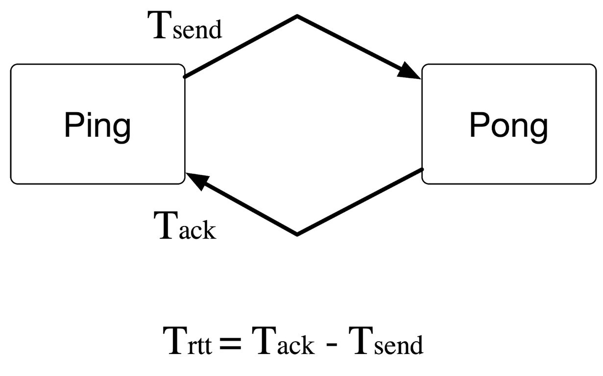

# Performance Evaluation
To ensure reliable and fair evaluations, the first step is setting up a stable and dedicated environment. This means minimizing factors that could influence performance results in any benchmarking process. The provided [guide](https://easyperf.net/blog/2019/08/02/Perf-measurement-environment-on-Linux) explains how to set up a consistent Linux environment effectively.

All tests were done on my workstations, which have an INTEL Corei7 1265U at 4.8GHz, 32 GB RAM, and run Mint 21.1 with Kernel 5.15.0-91-generic.

## Experiment Overview

The focus of the evaluation is on Round Trip Time (RTT) using a ping-pong application for each framework. This synthetic benchmark is crucial as it gives the minimum latency and shows how the system behaves under "async contention." RTT measures the time it takes for a message to be sent and acknowledged.

The picture below explains the ping-pong application and how RTT is calculated.



## Looking at the results

In the following, we are presenting the RTT results for all the frameworks under two different scenarios: over localhost and over the network
### Localhost

In our first series of tests, the ping-pong application is executed on a single machine, leveraging only localhost communication.

To replicate these experiments, you can build and run the RTT test by following these instructions:

```
git clone https://github.com/enum-class/cring-benchmarks.git
```
```
# To build boost-asio and libuv ping-pong server
cmake -B Release .
cmake --build Release
```
```
# To build glommio and tokio pingpong server
cargo build release
```
```
# To run different servers single thread
./Release/boost-server -t 1
./Release/uv-server -t 1
./target/release/monoio-server --cores 1
./target/release/glommio-server --cores 1
taskset -c 1 ./target/release/tokio-server --cores 1
```
```
# To run different servers multi-thread thread
./Release/boost-server -t 4
./target/release/monoio-server --cores 1 2 3 4
./target/release/glommio-server --cores 1 2 3 4
taskset -c 1-4 ./target/release/tokio-server --cores 1 2 3 4
```
```
# Run client
git clone https://github.com/enum-class/cring.git
cmake -B Release -DCRING_BENCHMARK=ON .
cmake --build Release
taskset -c 1-4 ./Release/benchmark/pingpong-client -t 4 -c 400 
```

One very important aspect to mention is that RTT depends on the load of the system. As you can see from the figure below, as the number of messages per second increases, RTT decreases. This is due to the fact that when messages are sent at a low rate, the processes are more likely to be de-scheduled by the operating system. This operation adds additional latency since the processes need to be rescheduled when messages are sent and received. This is true for both the Rust code and the classical ping, which is reported as a reference baseline for RTT.

#### Extreme performance testing
In this test we will start a fixed number of connections on the client side. The more connections, the higher the load on the server. This test aims to detect the extreme performance of the system.